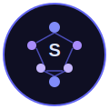

<a id="readme-top"></a>

<!-- PROJECT SHIELDS -->
[![Contributors][contributors-shield]][contributors-url]
[![Forks][forks-shield]][forks-url]
[![Stargazers][stars-shield]][stars-url]
[![Issues][issues-shield]][issues-url]
[![MIT License][license-shield]][license-url]
[![Build Status][build-shield]][build-url]
[![Tests][tests-shield]][tests-url]

<!-- LOGO -->
<div align="center">
  <br />
  <a href="https://github.com/tylerdotai/singularity">
    
  </a>

  <h1>Singularity</h1>

  <p>
    <strong>Provider-neutral, local-first AI agent harness</strong>
    <br />
    Built on Bun, TypeScript, and SQLite
  </p>

  <p>
    <a href="https://github.com/tylerdotai/singularity"><strong>Explore the docs</strong></a>
    ·
    <a href="https://github.com/tylerdotai/singularity/releases">Releases</a>
    ·
    <a href="https://github.com/tylerdotai/singularity/issues/new?labels=bug&template=bug-report---.md">Report Bug</a>
    ·
    <a href="https://github.com/tylerdotai/singularity/issues/new?labels=enhancement&template=feature-request---.md">Request Feature</a>
  </p>
</div>

<br />

<!-- TABLE OF CONTENTS -->
<details>
  <summary>Table of Contents</summary>
  <ol>
    <li><a href="#about-the-project">About The Project</a>
      <ul>
        <li><a href="#built-with">Built With</a></li>
      </ul>
    </li>
    <li><a href="#getting-started">Getting Started</a>
      <ul>
        <li><a href="#prerequisites">Prerequisites</a></li>
        <li><a href="#installation">Installation</a></li>
      </ul>
    </li>
    <li><a href="#usage">Usage</a></li>

    <li><a href="#contributing">Contributing</a></li>
    <li><a href="#license">License</a></li>
    <li><a href="#contact">Contact</a></li>
    <li><a href="#acknowledgments">Acknowledgments</a></li>
  </ol>
</details>

<!-- ABOUT THE PROJECT -->
## About The Project

Singularity is a **provider-neutral, local-first AI agent harness** with real-time WebSocket dashboard, multi-agent orchestration, and production-grade security. Data stored in SQLite under `~/.singularity/` — no cloud dependency, no vendor lock-in.

**Current Phase**: 20.0 — Hermes Replacement complete; Codex/OpenCode agent dispatch integrated

### Built With

- [![Bun][Bun-shield]][Bun-url]
- [![TypeScript][TypeScript-shield]][TypeScript-url]
- [![SQLite][SQLite-shield]][SQLite-url]
- [![Solid.js][Solid-shield]][Solid-url]

<p align="right">(<a href="#readme-top">back to top</a>)</p>

<!-- GETTING STARTED -->
## Getting Started

### Prerequisites

- [Bun](https://bun.sh) 1.3.x or later
- Node.js 18+ (for some dependencies)
- API keys for LLM providers (OpenAI, Anthropic, etc.)

### Installation

#### Quick Install

```bash
curl -fsSL https://raw.githubusercontent.com/tylerdotai/singularity/main/install.sh | bash
singularity setup
```

#### Manual Install

1. Clone the repository
   ```bash
   git clone https://github.com/tylerdotai/singularity.git
   cd singularity
   ```

2. Install dependencies and link CLI
   ```bash
   bun install
   bun link
   ```

3. Run setup
   ```bash
   singularity setup
   ```

4. Verify installation
   ```bash
   singularity doctor install
    bun run build    # TypeScript typecheck (zero errors)
    bun run test     # Run all 715 tests
   ```

<p align="right">(<a href="#readme-top">back to top</a>)</p>

<!-- USAGE -->
## Usage

### Quick Start

```bash
# Chat with the agent
singularity chat "Explain quantum computing in simple terms"

# Start production server
singularity server

# Run via Docker
docker-compose up -d
```

### Docker Deployment

```bash
# Clone the repository
git clone https://github.com/tylerdotai/singularity.git
cd singularity

# Copy and edit environment variables — REQUIRED
cp .env.example .env
# Set SINGULARITY_JWT_SECRET and SINGULARITY_ENCRYPTION_KEY in .env

# Build and start
docker-compose up --build -d

# Verify health
curl http://localhost:18678/health
# Expected: {"status":"healthy","uptime":...}

# View logs
docker-compose logs -f singularity

# Stop
docker-compose down
```

### CLI Commands

```bash
# Chat and interaction
singularity chat <msg>           # Chat with the agent
singularity subagent <goal>      # Spawn isolated subagent task
singularity plan <goal>          # Plan mode (read-only analysis)

# Server and loops
singularity server [port]        # Start production server (default: 18678)
singularity loops run <goal>     # Run closed-loop evaluator

# Gateway
singularity gateway start        # Launch Telegram/Discord gateway
singularity gateway status       # Show gateway config status

# Management
singularity profile list         # List profiles
singularity memory facts         # View stored facts
singularity skills list          # List available skills
singularity sessions             # List active sessions

# Diagnostics
singularity doctor install        # Run installation diagnostics
singularity doctor memory         # Run memory audit
singularity setup                # Interactive onboarding
singularity plan <goal>          # Plan mode (read-only analysis)
```

### API Reference

| Endpoint | Method | Description |
|----------|--------|-------------|
| `/health` | GET | Health check with status and uptime |
| `/metrics` | GET | Prometheus-compatible metrics export |
| `/api/keys` | POST | Generate API key |
| `/api/token` | POST | Generate JWT token |
| `/api/encrypt` | POST | Encrypt secret (AES-256-GCM) |
| `/api/decrypt` | POST | Decrypt ciphertext |
| `/api/events` | WS | WebSocket for live dashboard updates |

### Health Check

```bash
curl http://localhost:18678/health
# {"status":"healthy","uptime":1234,...}
```

### Prometheus Metrics

```bash
curl http://localhost:18678/metrics
# # TYPE singularity_requests_total counter
# singularity_requests_total{endpoint="/api/keys"} 42
```

### Production Hardening

Singularity ships with production-grade hardening enabled by default:

- **Secrets required** — `SINGULARITY_JWT_SECRET` and `SINGULARITY_ENCRYPTION_KEY` must be set or the server exits with code 1
- **Rate limiting** — 100 req/min per user on `/api/keys`, `/api/token`, `/api/encrypt`, `/api/decrypt` (returns `429 Too Many Requests`)
- **Non-root Docker** — Dockerfile runs as non-root `appuser`; `read_only: true` filesystem
- **Resource limits** — Docker Compose enforces 0.5 CPU / 512M memory limits
- **Graceful shutdown** — SIGTERM triggers clean `stop()` and exits with code 0
- **Startup validation** — `validateStartup()` checks config schema and API key formats on boot

<p align="right">(<a href="#readme-top">back to top</a>)</p>

<!-- CONTRIBUTING -->
## Contributing

1. Fork the Project
2. Create your Feature Branch (`git checkout -b feature/amazing-feature`)
3. Commit your Changes (`git commit -m 'Add some AmazingFeature'`)
4. Push to the Branch (`git push origin feature/amazing-feature`)
5. Open a Pull Request

<p align="right">(<a href="#readme-top">back to top</a>)</p>

<!-- LICENSE -->
## License

Distributed under the MIT License. See `LICENSE` for more information.

<p align="right">(<a href="#readme-top">back to top</a>)</p>

<!-- CONTACT -->
## Contact

Project Link: [https://github.com/tylerdotai/singularity](https://github.com/tylerdotai/singularity)

<p align="right">(<a href="#readme-top">back to top</a>)</p>

<!-- ACKNOWLEDGMENTS -->
## Acknowledgments

- [OpenCode](https://github.com/sst/opencode) — base codebase; CLI/TUI, plugin API, permission model
- [Best-README-Template](https://github.com/othneildrew/Best-README-Template) — README structure inspiration
- [NLM Memory](https://github.com/pbmagnet4/nlm-memory) — fact memory design reference
- [Hermes Agent](https://github.com/NousResearch/hermes-agent) — self-learning, gateway, scheduler reference
- [Pi](https://github.com/earendil-works/pi) — extension ergonomics, project trust, session branching reference

<p align="right">(<a href="#readme-top">back to top</a>)</p>

<!-- MARKDOWN LINKS & IMAGES -->
[contributors-shield]: https://img.shields.io/github/contributors/tylerdotai/singularity.svg?style=for-the-badge
[contributors-url]: https://github.com/tylerdotai/singularity/graphs/contributors
[forks-shield]: https://img.shields.io/github/forks/tylerdotai/singularity.svg?style=for-the-badge
[forks-url]: https://github.com/tylerdotai/singularity/network/members
[stars-shield]: https://img.shields.io/github/stars/tylerdotai/singularity.svg?style=for-the-badge
[stars-url]: https://github.com/tylerdotai/singularity/stargazers
[issues-shield]: https://img.shields.io/github/issues/tylerdotai/singularity.svg?style=for-the-badge
[issues-url]: https://github.com/tylerdotai/singularity/issues
[license-shield]: https://img.shields.io/github/license/tylerdotai/singularity.svg?style=for-the-badge
[license-url]: https://github.com/tylerdotai/singularity/blob/main/LICENSE
[build-shield]: https://img.shields.io/github/actions/workflow/status/tylerdotai/singularity/ci.yml?style=for-the-badge&label=build
[build-url]: https://github.com/tylerdotai/singularity/actions
[tests-shield]: https://img.shields.io/github/actions/workflow/status/tylerdotai/singularity/ci.yml?style=for-the-badge&label=tests
[tests-url]: https://github.com/tylerdotai/singularity/actions
[Bun-shield]: https://img.shields.io/badge/Bun-1.3.x-100%25?style=for-the-badge&logo=bun&logoColor=white
[Bun-url]: https://bun.sh/
[TypeScript-shield]: https://img.shields.io/badge/TypeScript-5.x?style=for-the-badge&logo=typescript&logoColor=white
[TypeScript-url]: https://www.typescriptlang.org/
[SQLite-shield]: https://img.shields.io/badge/SQLite-3.x?style=for-the-badge&logo=sqlite&logoColor=white
[SQLite-url]: https://www.sqlite.org/
[Solid-shield]: https://img.shields.io/badge/Solid.js-1.9.x?style=for-the-badge&logo=solidjs&logoColor=white
[Solid-url]: https://solidjs.com
